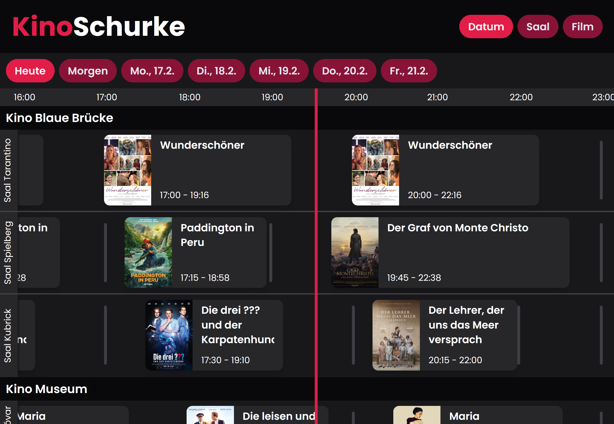

# Kinoschurke

## What is Kinoschurke?

Kinoschurke is a free, open-source website/app to help you quickly view movie show times across all cinemas in Tübingen as timelines. 
You can see what's playing now, what's about to start, plan for the next week, and even book your tickets.

## Why would someone create this website?

Has this ever happened to you? You love going to the movies, so much so that you buy an "Unlimited Subscription" to see even more movies at your local cinema. 
But now, there are so many movies to choose from that it's hard to decide which ones to see, when they're playing, and at which cinema. 
You visit the official page of your local cinemas, which is designed beautifully but somehow still doesn't organize movie show times in a way that feels natural to you.

So, like anyone would, you think to yourself, "*It can't be that hard to write a script that copies all the show times from the official site and 
build a custom website that displays these show times in a way that feels natural to me, preferably in a nice timeline overview per day, can it?*"

So yeah, that’s what happened and why I built this website. I hope you have fun using it!

## How does Kinoschurke work?
The data is retrieved from the official website of the [Tübinger Kinos](https://tuebinger-kinos.de/) and from [Kinoheld](https://kinoheld.de/), 
where the cinema program is updated every Tuesday. That's also where our name comes from: collecting our data from Kino*held* makes us the Kino*schurke*.

## Technologies used

### Frontend
- [React](https://reactjs.org/) (through [Vite](https://vitejs.dev/))
- [Font Awesome](https://fontawesome.com/)

### Backend
- [Node.js](https://nodejs.org/) with [Puppeteer](https://pptr.dev/)
